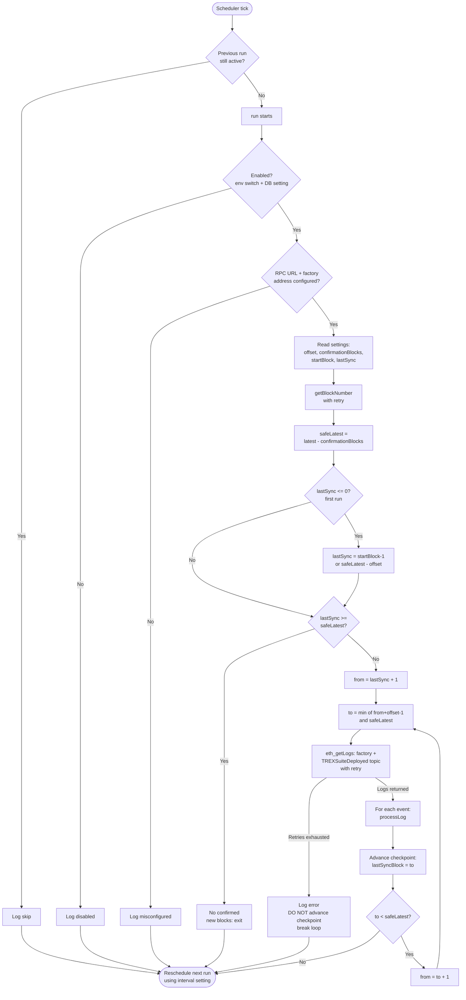
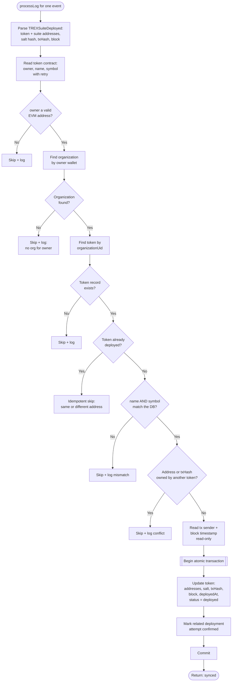

# Background TREX Deployment Sync (Fallback Reconciler)

A read-only background runner that recovers **missed** T-REX deployments. If the normal
two-phase flow fails to finalize — the user's session expired, the frontend never called
the final submit after on-chain confirmation, an RPC/network blip, lost localStorage, or the
backend was down at the wrong moment — this runner discovers the `TREXSuiteDeployed` event
directly from the blockchain and synchronizes the token record in the database.

It **never signs or submits a transaction**. Every chain interaction is a read
(`eth_getBlockNumber`, `eth_getLogs`, `eth_getTransaction`, `eth_getBlockByNumber`, and
`owner()`/`name()`/`symbol()` calls on the deployed token).

## Why this exists

The two-phase flow links a deployment to the DB via the `transactionHash` the frontend
reports. If that hand-off never happens, the backend has no pointer to the on-chain result.
This runner closes that gap by scanning the factory's events on a schedule and reconciling
independently of any frontend state.

## Scheduler

- Self-rescheduling in-process job (`src/jobs/trex-deployment-sync.runner.js`), started from
  `server.js` after the DB ping and stopped on graceful shutdown.
- Default interval **60 minutes**, read from General Settings **before each run** so it can be
  retuned without a restart.
- Overlap-guarded (a slow run never overlaps the next tick) and the timer is `unref`'d so it
  never blocks shutdown.
- Master off switch: env `TREX_DEPLOYMENT_SYNC_ENABLED=false` (overrides the DB setting).

## Configuration (General Settings, group `trexDeploymentSync`)

| Setting Key | Default | Meaning |
|---|---|---|
| `TrexDeploymentSyncInterval` | `60` | Runner interval in minutes. |
| `TrexDeploymentLastSyncBlock` | `0` | Checkpoint — last fully processed block. Never rescans the whole chain. |
| `TrexDeploymentBlockOffset` | `500` | Blocks per `eth_getLogs` request (prevents RPC range/timeout limits). |
| `TrexDeploymentConfirmationBlocks` | `12` | Reorg buffer; only blocks up to `latest - this` are processed. |
| `TrexDeploymentStartBlock` | `0` | Optional first-run start block. Set to the factory deploy block for full recovery; `0` starts one offset window behind the safe head. |
| `TrexDeploymentSyncEnabled` | `true` | On/off switch (DB-level). |

Blockchain config is reused from the existing env: `SEPOLIA_RPC_URL`, chain `11155111`, and
`TREX_FACTORY_ADDRESS` (`0xe221247C52ece62027eb7D01D0f522d7363Fe875`). No RPC URL or key is
hardcoded.

## Processing flow

1. Read settings (interval, last sync block, offset, confirmation blocks, start block).
2. `latest = getBlockNumber()`, `safeLatest = latest - confirmationBlocks`.
3. If `lastSync >= safeLatest`, exit (no confirmed work).
4. Scan in chunks: `from = lastSync + 1`, `to = min(from + offset - 1, safeLatest)`, calling
   `eth_getLogs({ address: factory, topics: [TREXSuiteDeployed], fromBlock, toBlock })`.
   Advance the checkpoint after **each** fully processed chunk; continue until `safeLatest`.

For every `TREXSuiteDeployed` event, extract token/IR/IRS/TIR/CTR/MC addresses, the salt
(the indexed event topic hash), the transaction hash, and the block number. Then:

- **Read metadata** from the token: `owner()`, `name()`, `symbol()` (read-only).
- **Verify ownership**: map `owner()` → an organization by wallet. No org → skip + log.
- **Verify token**: load that org's token record; compare on-chain `name`/`symbol` to the DB.
  Mismatch → skip + log.
- **Synchronize** (atomic transaction): update the token with token address, all suite
  registry addresses, salt, transaction hash, block number, deployment timestamp,
  `status = deployed`, `currentStep = deployed`, `isDraft = false`, and a
  `contractTxnMessage` marking it as sync-recovered. Any related deployment attempt is marked
  `confirmed` in the same transaction.

## Flowchart

### Scheduler and run loop



### Per-event processing: processLog



## Idempotency

- Already-deployed token with the same address → skip (no rewrite).
- Contract address or transaction hash already owned by another token → skip + log.
- The token update is guarded (`updateDeploymentByUserUid` only touches finalizable statuses),
  so reprocessing the same block produces no duplicates or overwrites.

## Retry & fallback

- RPC calls (`getBlockNumber`, `getLogs`, token reads, `getTransaction`, `getBlock`) retry up
  to 3 attempts with exponential backoff.
- If a chunk still fails, the runner logs the error, **does not advance the checkpoint**, and
  stops — the next scheduled run resumes from the same block.

## Reorg safety

The runner never processes the newest blocks. It stays `TrexDeploymentConfirmationBlocks`
behind the head, so blocks that could disappear in a reorg are not indexed.

## Observability

Each run logs: runner started/completed, latest block, safe latest block, from/to blocks,
blocks scanned, events found, deployments synchronized, deployments skipped (with reason),
retry attempts, errors with stack traces, and total duration. No secrets, tokens, or RPC
credentials are logged.

## Migration

`database/migrations/20260805_add_trex_deployment_sync.sql` seeds the six settings and adds a
nullable `deploymentSalt` column to `tokenMaster` (idempotent; existing deployed-token records
are never modified; operator-tuned values and the live checkpoint are preserved on re-run).

```bash
mysql -u root trexLaunchpad < database/migrations/20260805_add_trex_deployment_sync.sql
```

## Notes / assumptions

- Ownership matching relies on the deployed token's `owner()` equaling the organization's
  approved wallet, per spec. If your T-REX config sets a different owner (e.g. an agent or
  OnchainID), adjust `organizationRepository.findByWalletAddress` mapping accordingly — the
  runner logs every skip with the owner it saw, so mismatches are easy to diagnose.
- `_salt` is an indexed string in the event, so only its keccak256 hash is recoverable and is
  what gets stored in `deploymentSalt`. Verification uses `owner()`/`name()`/`symbol()`, not
  the salt.
