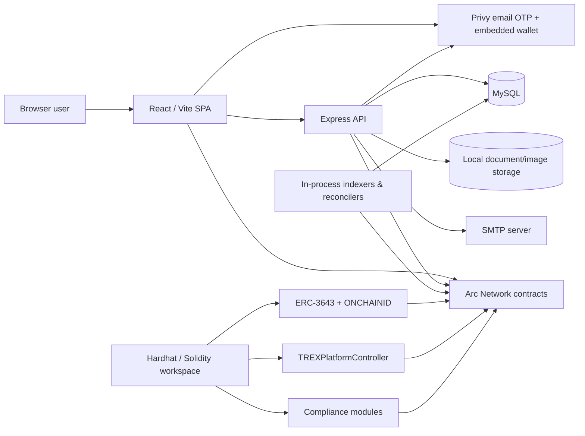

# T-REX Capital Market

A web3 capital-markets platform for compliant ERC-3643 (T-REX) token issuance, investor onboarding, wallet-based transactions, and on-chain reconciliation.

## Overview

T-REX Capital Market is a three-part application composed of a React/Vite web client, a Node.js/Express API backed by MySQL, and a Hardhat smart-contract workspace built around the ERC-3643 protocol and ONCHAINID.

The implemented product supports issuer and investor onboarding, organization and investor document workflows, compliant token configuration and deployment tracking, issuer/investor approval flows, identity claims and registry registration, marketplace discovery, token purchases/transfers/redemptions, portfolio and transaction views, and administrative review workflows.

Blockchain transaction flows are configured for **Arc Network (chain ID `5042`)**.

## Features

### Authentication and access control

- Email/password account creation and login.
- Privy email OTP verification for Issuer and Investor accounts.
- Privy embedded EVM wallet binding to application users.
- Backend-issued JWT bearer tokens after application authentication.
- Database-backed role and route permission checks.
- Password reset tokens delivered through configured SMTP.
- Seeded roles for Super Administrator, User, Issuer, and Investor.

### Issuer and organization workflows

- Organization/KYB profile management.
- Jurisdiction and beneficial-owner capture.
- Organization document upload, download, replacement/deletion, and submission for review.
- Administrative organization review and approval/rejection status handling.
- Token configuration covering information, claim topics, compliance rules, governance, and price.
- Token image processing and storage.
- Token deployment-attempt lifecycle with transaction verification and background deployment reconciliation.
- Investor directory, invitation, application/interest review, and approval/rejection workflows.
- Issuer claim signing and investor claim lifecycle support.
- Redemption request review and issuer authorization/execution workflow.

### Investor workflows

- Investor identity/KYC and compliance profile management.
- Investor onboarding document upload and submission.
- Token marketplace and token-detail views.
- Investment interests/applications and invitation tracking.
- Identity-registry registration flow.
- Claim preparation, submission, retry, and blockchain reconciliation.
- Wallet-executed token purchase and transfer flows.
- Redemption requests and status tracking.
- Portfolio, holdings, transaction history, and CSV transaction export.
- Wallet management for blockchain transaction flows.

### Blockchain and compliance

- ERC-3643 protocol integration through `@erc3643org/erc-3643`.
- ONCHAINID integration through `@onchain-id/solidity`.
- `TREXPlatformController` contract for priced token purchase/redemption settlement.
- Custom country-restriction, maximum-balance, and maximum-investor compliance modules.
- Arc Network RPC configuration in the frontend/backend runtime.
- Backend receipt/state verification rather than trusting browser-submitted transaction metadata alone.
- Checkpointed blockchain event indexing and recovery/reconciliation jobs.

### Operational capabilities

- MySQL persistence with explicit transaction support.
- Health endpoints at `/api/health` and `/api/v1/health`.
- Helmet, CORS allowlisting, compression, API/auth rate limiting, request IDs, and structured error responses.
- JSON file logging with sensitive-key redaction and retention cleanup.
- Swagger UI and an OpenAPI source file.
- Postman collection.
- Backend integration tests and smart-contract tests.
- Frontend linting, formatting, and production build tooling.

## Technology Stack

| Area | Technologies |
| --- | --- |
| Frontend | React 19, Vite, React Router, TanStack Query, Axios, Zustand, React Hook Form, Zod, Tailwind CSS, Framer Motion, Lucide, Sonner |
| Authentication / Wallet | Privy React Auth, Privy Node SDK, embedded EVM wallets, JWT |
| Web3 client | Viem |
| Backend | Node.js, Express 5, CommonJS, Joi |
| Database | MySQL 8+, `mysql2` |
| Blockchain | Solidity 0.8.17, Hardhat, Ethers v6, ERC-3643, ONCHAINID, OpenZeppelin Contracts 4.9 |
| File handling | Multer, Sharp, local filesystem storage, SHA-256 checksums |
| Email | Nodemailer / SMTP |
| API documentation | Swagger UI, OpenAPI YAML, Postman collection |
| Security / middleware | Helmet, CORS, `express-rate-limit`, bcryptjs |
| Testing | Node.js `node:test`, Supertest, Hardhat test suite |

## Project Architecture

The repository contains three independently managed Node/npm workspaces; there is no root `package.json` or root orchestration script.

- **Frontend** is a React single-page application. It authenticates users through the backend and Privy, initiates wallet-signed blockchain transactions, and presents issuer, investor, and admin workflows.
- **Backend** owns business data, access control, onboarding/document state, review workflows, transaction observation, blockchain verification, indexing, and reconciliation.
- **T-Rex** contains the Solidity contracts, tests, deployment scripts, and synced ERC-3643 artifacts used for protocol-level development/deployment.

The current transaction model intentionally separates **transaction execution** from **application verification**: supported purchase, transfer, claim/registry, and redemption interactions are signed by the appropriate authenticated wallet, while the backend verifies receipts/on-chain state and maintains canonical application history.



### Major backend layers

| Layer | Responsibility |
| --- | --- |
| `api/v1` | Route registration and HTTP controllers for auth, organizations, tokens, investors, investments, claims, and master data |
| `middleware` | Authentication, authorization, validation, rate limiting, request IDs, CORS/error behavior, and uploads |
| `services` | Business workflows, blockchain verification, identity/claim handling, transaction indexing, file handling, email, and logging |
| `repositories` | MySQL data access and persistence operations |
| `schemas` | Joi request validation schemas |
| `jobs` | In-process blockchain synchronization/indexing/recovery runners |
| `database` | Connection pool and database helpers |
| `dependencies` | Application service/repository/job composition |

## Project Structure

```text
.
├── Backend/
│   ├── database/
│   │   ├── trex-capital-market.sql
│   │   ├── migrations/
│   │   ├── seed-admin-direct.sql
│   │   └── fix-linux-table-name-case.sql
│   ├── docs/
│   │   └── openapi.yaml
│   ├── postman/
│   ├── public/
│   │   └── logs/                 # Runtime logs; not application source
│   ├── scripts/
│   ├── src/
│   │   ├── api/v1/
│   │   ├── core/
│   │   ├── database/
│   │   ├── dependencies/
│   │   ├── jobs/
│   │   ├── middleware/
│   │   ├── repositories/
│   │   ├── schemas/
│   │   ├── services/
│   │   └── server.js
│   ├── storage/                  # Runtime document/image storage
│   ├── tests/
│   └── package.json
├── Frontend/
│   ├── public/
│   ├── src/
│   │   ├── api/
│   │   ├── components/
│   │   ├── config/
│   │   ├── layouts/
│   │   ├── pages/
│   │   ├── routes/
│   │   ├── services/
│   │   │   ├── blockchain/
│   │   │   └── wallet/
│   │   ├── store/
│   │   └── main.jsx
│   ├── .env.example
│   ├── vite.config.js
│   └── package.json
└── T-Rex/
    ├── contracts/
    │   ├── modules/
    │   ├── platform/
    │   └── mocks/
    ├── scripts/
    ├── test/
    ├── deployments/
    ├── hardhat.config.ts
    ├── .env.example
    └── package.json
```

`T-Rex/artifacts`, `T-Rex/cache`, and `T-Rex/typechain-types` are generated Hardhat outputs and are not primary source directories.

## Prerequisites

To run the complete application locally, use the strictest runtime requirement declared by the individual workspaces:

- **Node.js `>=22.22.1`** — required by the frontend and also satisfies the backend requirement of Node.js `>=20`.
- **npm `>=10`** — declared by the frontend.
- **MySQL 8+**.
- **Privy application credentials** for the browser and backend SDKs.
- **SMTP server credentials**. The backend validates SMTP settings at startup.
- **Arc Network RPC access** and the public contract addresses used by the application.
- A funded wallet/environment appropriate to any on-chain operation you intend to execute.

## Installation

There is no root installer. Install each workspace independently.

### 1. Backend dependencies

```bash
cd Backend
npm ci
cp .env.example .env
```

Configure `.env` before starting the API. See [Environment Configuration](#environment-configuration).

### 2. Database initialization

The base schema creates the `trexCapitalMarket` database:

```bash
mysql -u root -p < database/trex-capital-market.sql
```

Then seed location reference data:

```bash
npm run seed:locations
```

An administrator can be created after setting `ADMIN_FULL_NAME`, `ADMIN_EMAIL`, `ADMIN_PASSWORD`, and optionally `ADMIN_ROLE_UID`:

```bash
npm run seed:admin
```
### 3. Frontend dependencies

```bash
cd ../Frontend
npm ci
cp .env.example .env
```

Configure the frontend API/Privy/Web3 settings before starting Vite.

### 4. Smart-contract workspace

```bash
cd ../T-Rex
npm ci
cp .env.example .env
npm run compile
npm test
```

## Environment Configuration

Never commit or publish secrets. In particular, backend/deployment private keys, JWT secrets, SMTP passwords, and the Privy app secret must remain server-side. Every `VITE_*` value is browser-visible after a frontend build and must be treated as public configuration.

### Backend required-at-startup variables

The backend validates these values before opening the HTTP server:

| Variable | Purpose |
| --- | --- |
| `DB_HOST` | MySQL host |
| `DB_NAME` | MySQL database name |
| `DB_USER` | MySQL user |
| `DB_PASSWORD` | MySQL password; the validator allows an empty string |
| `JWT_SECRET` | JWT signing secret; minimum 32 characters |
| `PRIVY_APP_ID` | Privy application ID used by the server SDK |
| `PRIVY_APP_SECRET` | Privy server secret |
| `SMTP_HOST` | SMTP host |
| `SMTP_USER` | SMTP user |
| `SMTP_PASSWORD` | SMTP password |
| `SMTP_FROM_EMAIL` | Sender address for application email |

### Backend configuration groups

The following names are read by the current configuration module and/or seed scripts:

| Area | Variables |
| --- | --- |
| Application | `NODE_ENV`, `PORT`, `APP_NAME`, `APP_VERSION`, `APP_BASE_URL`, `FRONTEND_URL` |
| Database | `DB_HOST`, `DB_PORT`, `DB_NAME`, `DB_USER`, `DB_PASSWORD`, `DB_CONNECTION_LIMIT` |
| JWT / auth | `JWT_SECRET`, `JWT_EXPIRY`, `ISSUER_ROLE_UID`, `INVESTOR_ROLE_UID`, `BCRYPT_ROUNDS`, `PASSWORD_RESET_TOKEN_TTL_MINUTES` |
| Privy | `PRIVY_APP_ID`, `PRIVY_APP_SECRET` |
| SMTP | `SMTP_HOST`, `SMTP_PORT`, `SMTP_SECURE`, `SMTP_USER`, `SMTP_PASSWORD`, `SMTP_FROM_NAME`, `SMTP_FROM_EMAIL` |
| HTTP security | `ALLOWED_ORIGINS`, `CORS_CREDENTIALS`, `RATE_LIMIT_WINDOW_MS`, `RATE_LIMIT_MAX`, `AUTH_RATE_LIMIT_MAX`, `TRUST_PROXY` |
| Logging | `LOG_LEVEL`, `LOG_RETENTION_DAYS` |
| Organization uploads | `UPLOAD_DIR`, `UPLOAD_MAX_FILE_SIZE_MB`, `UPLOAD_MAX_FILES` |
| Investor uploads | `INVESTOR_UPLOAD_DIR`, `INVESTOR_UPLOAD_MAX_FILE_SIZE_MB`, `INVESTOR_UPLOAD_MAX_FILES` |
| Token images | `TOKEN_IMAGE_UPLOAD_DIR`, `TOKEN_IMAGE_MAX_FILE_SIZE_MB`, `TOKEN_IMAGE_MIN_DIMENSION`, `TOKEN_IMAGE_MAX_DIMENSION`, `TOKEN_IMAGE_OPTIMIZED_MAX_DIMENSION`, `TOKEN_IMAGE_VIRUS_SCANNER_PATH`, `TOKEN_IMAGE_VIRUS_SCAN_TIMEOUT_MS` |
| Core blockchain | `BLOCKCHAIN_RPC_URL`, `BLOCKCHAIN_FALLBACK_RPC_URLS`, `IDENTITY_FACTORY_ADDRESS`, `TREX_FACTORY_ADDRESS`, `DEPLOYER_PRIVATE_KEY`, `DEPLOYER_ADDRESS`, `PLATFORM_CONTROLLER_ADDRESS`, `BLOCKCHAIN_CONFIRMATIONS`, `BLOCKCHAIN_CHAIN_ID`, `SUPPORTED_CHAIN_IDS`, `BLOCKCHAIN_NETWORK_NAME`, `BLOCKCHAIN_TRANSACTION_TIMEOUT_MS` |
| Registry / recovery | `REGISTRY_CONFIRMATIONS`, `REGISTRY_DELEGATION_MANAGER_ADDRESSES`, `TRANSACTION_DELEGATION_MANAGER_ADDRESSES`, `REGISTRY_RECOVERY_LOOKBACK_BLOCKS`, `REGISTRY_RECOVERY_BLOCK_OFFSET`, `REGISTRY_RPC_EVIDENCE_ATTEMPTS`, `TREX_FACTORY_START_BLOCK`, `CLAIM_INDEXER_START_BLOCK`, `REGISTRY_INDEXER_START_BLOCK`, `RECONCILE_BLOCK_OFFSET`, `RECONCILE_MAX_LOOKBACK_BLOCKS` |
| Deployment sync | `DEPLOYMENT_ATTEMPT_TTL_MINUTES`, `TREX_DEPLOYMENT_SYNC_ENABLED` |
| Canonical transaction indexer | `TRANSACTION_INDEXER_ENABLED`, `TRANSACTION_INDEXER_START_BLOCK`, `TRANSACTION_INDEXER_CONFIRMATIONS` |
| Admin seed | `ADMIN_FULL_NAME`, `ADMIN_EMAIL`, `ADMIN_PASSWORD`, `ADMIN_ROLE_UID` |

### Safe backend `.env` example

```dotenv
NODE_ENV=development
PORT=3000
APP_NAME=T-REX Capital Market
APP_VERSION=1.0.0
APP_BASE_URL=http://localhost:3000
FRONTEND_URL=http://localhost:5173

DB_HOST=127.0.0.1
DB_PORT=3306
DB_NAME=trexCapitalMarket
DB_USER=<mysql-user>
DB_PASSWORD=<mysql-password>
DB_CONNECTION_LIMIT=10

JWT_SECRET=<at-least-32-random-characters>
JWT_EXPIRY=1h
BCRYPT_ROUNDS=<production-appropriate-cost>
PASSWORD_RESET_TOKEN_TTL_MINUTES=30

PRIVY_APP_ID=<privy-app-id>
PRIVY_APP_SECRET=<privy-app-secret>

SMTP_HOST=<smtp-host>
SMTP_PORT=587
SMTP_SECURE=false
SMTP_USER=<smtp-user>
SMTP_PASSWORD=<smtp-password>
SMTP_FROM_NAME=T-REX Capital Market
SMTP_FROM_EMAIL=<verified-sender@example.com>

ALLOWED_ORIGINS=http://localhost:5173
CORS_CREDENTIALS=true
RATE_LIMIT_WINDOW_MS=60000
RATE_LIMIT_MAX=100
AUTH_RATE_LIMIT_MAX=10

BLOCKCHAIN_RPC_URL=<arc-testnet-rpc-url>
BLOCKCHAIN_FALLBACK_RPC_URLS=
BLOCKCHAIN_CHAIN_ID=5042
SUPPORTED_CHAIN_IDS=5042
BLOCKCHAIN_NETWORK_NAME=arc-testnet
IDENTITY_FACTORY_ADDRESS=<public-contract-address>
TREX_FACTORY_ADDRESS=<public-contract-address>
PLATFORM_CONTROLLER_ADDRESS=<public-contract-address>
DEPLOYER_ADDRESS=<public-platform-wallet-address>
DEPLOYER_PRIVATE_KEY=<secret-server-side-private-key>
BLOCKCHAIN_CONFIRMATIONS=1
REGISTRY_CONFIRMATIONS=1
TRANSACTION_INDEXER_ENABLED=true
```

The code currently defaults `BCRYPT_ROUNDS` to `2` if it is omitted. That is unsuitable as a production password-hashing cost; explicitly configure an appropriately reviewed production value.

### Frontend variables

| Area | Variables |
| --- | --- |
| Application/API | `VITE_APP_NAME`, `VITE_APP_VERSION`, `VITE_API_BASE_URL`, `VITE_API_VERSION`, `VITE_SOCKET_URL`, `VITE_REQUEST_TIMEOUT`, `VITE_USE_MOCK_API` |
| UI/build | `VITE_ENABLE_DARK_MODE`, `VITE_ENABLE_ANALYTICS`, `VITE_UI_DATE_OFFSET_DAYS`, `VITE_ENABLE_SOURCEMAPS`, `VITE_DEV_PORT`, `VITE_PREVIEW_PORT` |
| Parsed optional integrations | `VITE_FIREBASE_API_KEY`, `VITE_SENTRY_DSN` |
| Privy | `VITE_PRIVY_APP_ID`, `VITE_PRIVY_CLIENT_ID` |
| Chain | `VITE_WEB3_DEFAULT_CHAIN`, `VITE_WEB3_ENABLED_CHAINS`, `VITE_ARC_TESTNET_RPC_URL` |
| Public contracts | `VITE_TREX_GATEWAY_ADDRESS`, `VITE_TREX_PLATFORM_WALLET_ADDRESS`, `VITE_TREX_PLATFORM_CONTROLLER_ADDRESS`, `VITE_TREX_PAYMENT_TOKEN_ADDRESS`, `VITE_ONCHAIN_ID_FACTORY_ADDRESS`, `VITE_COUNTRY_RESTRICT_MODULE_ADDRESS`, `VITE_MAX_BALANCE_MODULE_ADDRESS`, `VITE_MAX_INVESTORS_MODULE_ADDRESS` |

The frontend configuration parses Firebase/Sentry/socket/analytics settings, but no complete active Firebase or Sentry integration was verified in the current application source. Treat those values as reserved configuration unless the corresponding integration is enabled separately.

### Safe frontend `.env` example

```dotenv
VITE_APP_NAME=T-REX Capital Market
VITE_APP_VERSION=1.0.0
VITE_API_BASE_URL=http://localhost:3000/api
VITE_API_VERSION=v1
VITE_REQUEST_TIMEOUT=500000
VITE_USE_MOCK_API=false
VITE_ENABLE_DARK_MODE=false
VITE_ENABLE_ANALYTICS=false
VITE_UI_DATE_OFFSET_DAYS=0
VITE_ENABLE_SOURCEMAPS=false
VITE_DEV_PORT=5173
VITE_PREVIEW_PORT=4173

VITE_PRIVY_APP_ID=<public-privy-app-id>
VITE_PRIVY_CLIENT_ID=<optional-public-privy-client-id>

VITE_WEB3_DEFAULT_CHAIN=arc-testnet
VITE_WEB3_ENABLED_CHAINS=arc-testnet
VITE_ARC_TESTNET_RPC_URL=<arc-testnet-rpc-url>

VITE_TREX_GATEWAY_ADDRESS=<public-contract-address>
VITE_TREX_PLATFORM_WALLET_ADDRESS=<public-wallet-address>
VITE_TREX_PLATFORM_CONTROLLER_ADDRESS=<public-contract-address>
VITE_TREX_PAYMENT_TOKEN_ADDRESS=<public-payment-token-address>
VITE_ONCHAIN_ID_FACTORY_ADDRESS=<public-contract-address>
VITE_COUNTRY_RESTRICT_MODULE_ADDRESS=<public-contract-address>
VITE_MAX_BALANCE_MODULE_ADDRESS=<public-contract-address>
VITE_MAX_INVESTORS_MODULE_ADDRESS=<public-contract-address>
```

## Database

### Technology and conventions

- MySQL 8+ / InnoDB.
- `utf8mb4` character set.
- UTC session timestamps using `DATETIME(3)` patterns in the schema.
- `mysql2` connection pooling.
- Application-layer transactions for multi-step state changes.
- The schema intentionally does not rely on database foreign-key constraints; relational consistency is enforced by application logic and transaction handling.
- Soft-delete fields are used across master/business entities.

### Important table groups

| Domain | Representative tables |
| --- | --- |
| Users / RBAC | `userRole`, `userMaster`, `menuMaster`, `permissionMaster`, `authToken` |
| General/master data | `generalSettings`, `entityTypeMaster`, `industryMaster`, `documentTypeMaster`, `countryMaster`, `stateMaster`, `cityMaster` |
| Organizations | `organizationMaster`, `organizationBeneficialOwner`, `organizationDocument` |
| Token setup | `tokenMaster`, `tokenClaimTopic`, `tokenCountryRestriction`, `tokenDeploymentAttempt` |
| Investor onboarding | `investorMaster`, `investorInvestmentCategory`, `investorDocumentTypeMaster`, `investorDocument` |
| Investment workflow | `tokenInvestmentInterest`, `tokenInvestmentInterestHistory`, `investmentSubmissionDocument`, `investorInvitation` |
| Claims / identity | `issuerClaimVerification`, `issuerClaimSignature`, `investorClaimSubmission`, `investorClaimBlockchainEvent`, `identityRegistryRegistration`, `identityRegistryBlockchainEvent` |
| Purchases | `tokenPurchase`, `tokenPurchaseTransaction`, `tokenPurchasePaymentEvent` |
| Redemptions | `tokenRedemption` plus its transaction/history/payment-event tables |
| Transfers | `tokenTransfer`, `tokenTransferTransaction`, `tokenTransferEvent` |
| Canonical chain history | `blockchainTransaction`, `blockchainIndexedContract`, `blockchainIndexerCheckpoint` |

The schema seeds base roles, menu/permission data, general settings, and claim topics including KYC and accredited-investor topics.

### Database scripts

```bash
# Base schema
mysql -u root -p < database/trex-capital-market.sql

# Reference locations
npm run seed:locations

# Admin account, after ADMIN_* variables are configured
npm run seed:admin
```

No `npm run migrate` command exists. SQL migrations are managed as individual files in `database/migrations/` and must be applied according to the target database's actual schema revision.

For databases imported from a case-insensitive Windows MySQL environment to Linux, the repository includes `database/fix-linux-table-name-case.sql` to address table-name casing differences.

## Running the Project

### Backend development

```bash
cd Backend
npm run dev
```

### Backend production process

```bash
cd Backend
npm start
```

The backend starts its active blockchain index/reconciliation jobs in the same Node.js process; there is no separate queue-worker command.

### Frontend development

```bash
cd Frontend
npm run dev
```

Vite defaults to port `5173` unless `VITE_DEV_PORT` is changed.

### Frontend production build

```bash
cd Frontend
npm run build
```

The build output is `Frontend/dist/` and should be served by a static web server/CDN configured with SPA history fallback.

To preview the production bundle locally:

```bash
npm run preview
```

### Smart-contract development

```bash
cd T-Rex
npm run compile
npm test
```

Available contract scripts are:

```bash
npm run deploy:compliance-modules
npm run deploy:platform-controller
npm run wire:platform-controller
npm run phase0:deploy-platform
npm run phase0:redeploy-factory
npm run sync:erc3643-artifacts
npm run diagnose:transfer
```

## API Documentation

### Base URLs

The backend mounts its API at:

```text
http://localhost:3000/api
http://localhost:3000/api/v1
```

The frontend constructs requests from:

```text
VITE_API_BASE_URL + "/" + VITE_API_VERSION
```

For local development, a matching configuration is:

```dotenv
VITE_API_BASE_URL=http://localhost:3000/api
VITE_API_VERSION=v1
```

### Health endpoints

```http
GET /api/health
GET /api/v1/health
```

The health response includes application status, environment, version, uptime, and a UTC timestamp.

### Authentication header

Protected endpoints use the application JWT:

```http
Authorization: Bearer <jwt>
```

### Current route inventory

The following routes are mounted by the current Express router.

#### Authentication

| Method | Route | Purpose |
| --- | --- | --- |
| `POST` | `/api/v1/auth/signup` | Create an account |
| `POST` | `/api/v1/auth/privy/complete-signup` | Verify Privy identity/wallet and complete Issuer/Investor signup |
| `POST` | `/api/v1/auth/login` | Password login; Issuer/Investor login can require a Privy identity token |
| `POST` | `/api/v1/auth/forgot-password` | Create and email a password-reset token |
| `GET` | `/api/v1/auth/verify-reset-token` | Validate a reset token |
| `POST` | `/api/v1/auth/reset-password` | Set a new password using a valid reset token |

#### Public reference data

| Method | Route |
| --- | --- |
| `GET` | `/api/v1/token-options` |
| `GET` | `/api/v1/locations/countries` |
| `GET` | `/api/v1/locations/countries/:countryUid/states` |
| `GET` | `/api/v1/locations/states/:stateUid/cities` |
| `GET` | `/api/v1/organization-options` |
| `GET` | `/api/v1/investor-options` |
| `GET` | `/api/v1/general-settings/public` |

#### Organization / KYB

| Method | Route |
| --- | --- |
| `GET` | `/api/v1/organizations/me` |
| `PATCH` | `/api/v1/organizations/me/user-notified` |
| `PUT` | `/api/v1/organizations/me/company-information` |
| `PUT` | `/api/v1/organizations/me/jurisdiction` |
| `PUT` | `/api/v1/organizations/me/beneficial-owners` |
| `POST` | `/api/v1/organizations/me/documents` |
| `GET` | `/api/v1/organizations/me/documents` |
| `GET` | `/api/v1/organizations/me/documents/:documentUid/download` |
| `DELETE` | `/api/v1/organizations/me/documents/:documentUid` |
| `POST` | `/api/v1/organizations/me/submit` |

#### Admin organization review

| Method | Route |
| --- | --- |
| `GET` | `/api/v1/admin/organizations` |
| `GET` | `/api/v1/admin/organizations/:organizationUid` |
| `PATCH` | `/api/v1/admin/organizations/:organizationUid/status` |
| `GET` | `/api/v1/admin/organizations/:organizationUid/documents/:documentUid/file` |

#### Token configuration / deployment

| Method | Route |
| --- | --- |
| `GET` | `/api/v1/tokens/me` |
| `PUT` | `/api/v1/tokens/me/information` |
| `GET` | `/api/v1/tokens/me/image` |
| `PUT` | `/api/v1/tokens/me/claims` |
| `PUT` | `/api/v1/tokens/me/compliance` |
| `PUT` | `/api/v1/tokens/me/governance` |
| `PATCH` | `/api/v1/tokens/me/price` |
| `POST` | `/api/v1/tokens/me/deployment-attempts` |
| `GET` | `/api/v1/tokens/me/deployment-attempts/active` |
| `PATCH` | `/api/v1/tokens/me/deployment-attempts/:deploymentAttemptUid/submitted` |
| `PATCH` | `/api/v1/tokens/me/deployment-attempts/:deploymentAttemptUid/fail` |
| `POST` | `/api/v1/tokens/me/submit` |

#### Investor profile / KYC

| Method | Route |
| --- | --- |
| `GET` | `/api/v1/investors/me` |
| `PUT` | `/api/v1/investors/me/identity` |
| `PUT` | `/api/v1/investors/me/compliance` |
| `POST` | `/api/v1/investors/me/documents` |
| `GET` | `/api/v1/investors/me/documents` |
| `GET` | `/api/v1/investors/me/documents/:documentUid/download` |
| `DELETE` | `/api/v1/investors/me/documents/:documentUid` |
| `POST` | `/api/v1/investors/me/submit` |

#### Investment, invitation, registry, transaction, and redemption workflows

| Method | Route |
| --- | --- |
| `POST` | `/api/v1/investments/transactions/confirm` |
| `GET` | `/api/v1/investments/transactions` |
| `GET` | `/api/v1/investments/transactions/export` |
| `GET` | `/api/v1/investments/tokens` |
| `GET` | `/api/v1/investments/tokens/:tokenUid` |
| `GET` | `/api/v1/investments/tokens/:tokenUid/image` |
| `GET` | `/api/v1/investments/tokens/:tokenUid/transfers` |
| `GET` | `/api/v1/investments/transfers/:transferUid` |
| `GET` | `/api/v1/investments/tokens/:tokenUid/purchases` |
| `GET` | `/api/v1/investments/purchases/:purchaseUid` |
| `POST` | `/api/v1/investments/tokens/:tokenUid/redemptions` |
| `GET` | `/api/v1/investments/tokens/:tokenUid/redemptions` |
| `GET` | `/api/v1/investments/redemptions/:redemptionUid` |
| `POST` | `/api/v1/investments/redemptions/:redemptionUid/authorize` |
| `POST` | `/api/v1/investments/redemptions/:redemptionUid/cancel` |
| `GET` | `/api/v1/investments/me/portfolio` |
| `GET` | `/api/v1/investments/tokens/:tokenUid/required-documents` |
| `POST` | `/api/v1/investments/tokens/:tokenUid/interest` |
| `GET` | `/api/v1/investments/me/interests` |
| `GET` | `/api/v1/investments/me/interests/:interestUid/history` |
| `GET` | `/api/v1/investments/me/invitations` |
| `GET` | `/api/v1/investments/me/invitations/:invitationUid` |
| `PATCH` | `/api/v1/investments/me/invitations/:invitationUid/viewed` |
| `POST` | `/api/v1/investments/issuer/interests/:interestUid/registry-registration` |
| `GET` | `/api/v1/investments/issuer/interests/:interestUid/registry-registration` |
| `POST` | `/api/v1/investments/issuer/interests/:interestUid/registry-registration/:registryRegistrationUid/confirm` |
| `GET` | `/api/v1/investments/issuer/investors` |
| `POST` | `/api/v1/investments/issuer/investors/:investorUid/invitations` |
| `GET` | `/api/v1/investments/issuer/interests` |
| `GET` | `/api/v1/investments/issuer/interests/:interestUid` |
| `POST` | `/api/v1/investments/issuer/interests/:interestUid/approve` |
| `POST` | `/api/v1/investments/issuer/interests/:interestUid/reject` |
| `GET` | `/api/v1/investments/issuer/interests/:interestUid/history` |
| `GET` | `/api/v1/investments/issuer/interests/:interestUid/documents/:documentUid/download` |
| `GET` | `/api/v1/investments/issuer/redemptions` |
| `GET` | `/api/v1/investments/issuer/redemptions/:redemptionUid` |
| `POST` | `/api/v1/investments/issuer/redemptions/:redemptionUid/approve` |
| `POST` | `/api/v1/investments/issuer/redemptions/:redemptionUid/reject` |

#### Issuer claims

| Method | Route |
| --- | --- |
| `POST` | `/api/v1/issuer/claims/sign` |
| `GET` | `/api/v1/issuer/claims/:subscriptionId` |

#### Investor claims

| Method | Route |
| --- | --- |
| `GET` | `/api/v1/investor/claims` |
| `POST` | `/api/v1/investor/claims/:claimId/prepare` |
| `POST` | `/api/v1/investor/claims/:claimId/retry` |
| `POST` | `/api/v1/investor/claims/:claimId/submit` |

#### Generic master-data CRUD

The current API also mounts generic authenticated CRUD routers at:

```text
/api/v1/users
/api/v1/roles
/api/v1/menus
/api/v1/permissions
/api/v1/general-settings
```

Each generic router exposes `POST /`, `GET /`, `GET /:<entityUid>`, `PUT /:<entityUid>`, and soft-delete `DELETE /:<entityUid>` patterns using the concrete parameter names `userUid`, `roleUid`, `menuUid`, `permissionUid`, or `settingUid`, subject to route permissions.

### Request examples

#### Signup

```http
POST /api/v1/auth/signup
Content-Type: application/json
```

```json
{
  "fullName": "Example User",
  "email": "user@example.com",
  "password": "<strong-password>",
  "isIssuer": false
}
```

The signup validator requires an 8–72 character password containing lowercase, uppercase, numeric, and special characters.

#### Complete Privy signup

After the browser completes Privy email OTP and obtains a Privy identity token:

```http
POST /api/v1/auth/privy/complete-signup
Content-Type: application/json
```

```json
{
  "email": "user@example.com",
  "identityToken": "<privy-identity-token>"
}
```

The backend verifies the identity token, matches the verified email, resolves the Privy embedded EVM wallet, stores the Privy user/wallet association, marks the application's email-verification state, and issues the application JWT.

### Response conventions

Successful responses use the shared envelope:

```json
{
  "success": true,
  "message": "Operation completed",
  "data": {},
  "timestamp": "<UTC ISO timestamp>",
  "requestId": "<request-id>"
}
```

Paginated/list responses may also include `meta`.

Errors use:

```json
{
  "success": false,
  "message": "Request failed",
  "error": {
    "code": "<error-code>",
    "details": {}
  },
  "timestamp": "<UTC ISO timestamp>",
  "requestId": "<request-id>"
}
```

The error middleware normalizes application errors plus invalid/expired JWTs, duplicate-record database errors, relation/database failures, invalid JSON, and Multer upload errors.

### Swagger / OpenAPI / Postman

- Swagger UI: `GET /api-docs`
- OpenAPI source: `Backend/docs/openapi.yaml`
- Postman collection: `Backend/postman/Trex Capital Market Backend.postman_collection.json`

## Authentication & Authorization

### Issuer / Investor signup flow

1. The user submits `fullName`, `email`, `password`, and `isIssuer` to `/auth/signup`.
2. The browser performs Privy email OTP verification.
3. The frontend creates/resolves the user's Privy embedded EVM wallet.
4. The frontend sends the Privy identity token to `/auth/privy/complete-signup`.
5. The backend uses the Privy Node SDK to verify the token, email, Privy user ID, and embedded wallet.
6. The backend binds the verified Privy identity/wallet to the user and returns an application JWT.

### Issuer / Investor login flow

Issuer/Investor login is two-stage when Privy verification is needed:

1. `POST /auth/login` validates email/password.
2. For Privy-managed roles, a valid password can return a `privyVerificationRequired` response rather than a JWT.
3. The browser completes Privy OTP and resubmits login with the Privy `identityToken`.
4. The backend verifies that the Privy email/wallet match the stored user identity and then issues the JWT.

Super Administrator accounts use the backend password flow and must satisfy the application's email-verification state.

### JWT and route authorization

The backend JWT includes the authenticated user's identity/role information and is validated as a bearer token. Protected routes then pass through database-backed authorization: the middleware resolves the current Express route path and checks it against permission data.

### Password reset

`forgot-password` creates an opaque reset token, stores only its hash, applies the configured TTL, and sends the reset link/instructions through SMTP. The token can be checked through `verify-reset-token` and consumed by `reset-password`.

## Blockchain / Web3

### Runtime network

The current application runtime is configured for:

| Property | Value |
| --- | --- |
| Network | Arc Mainnet |
| Chain ID | `5042` |
| Native asset label in frontend config | USD Coin (`USDC`) |
| Block confirmations default | `1` |

Transaction-critical application flows use Arc Network.

### ERC-3643 / ONCHAINID

The project uses the official `@erc3643org/erc-3643` package plus `@onchain-id/solidity`. The application database tracks identity/claim/registry and token deployment state while on-chain state remains authoritative for executed transactions.

### Custom contracts

#### `TREXPlatformController.sol`

The platform controller implements the platform's priced settlement layer and includes:

- Owner-managed payment-token configuration.
- Issuer-controlled per-token pricing (`token.owner()` is used for issuer authority).
- Pause/unpause controls.
- Atomic purchase flow combining payment transfer and token minting.
- Atomic redemption flow combining token burn and payment payout.
- Allowance/balance/agent-role checks.
- Reentrancy protection.
- Buy/redeem quote helpers and token information lookup.
- Purchase, redemption, price-update, and payment-token events.

Its Hardhat tests cover constructor/configuration behavior, pricing authorization, pausing, successful and failing purchase/redemption conditions, and quote/info helpers.

#### Compliance modules

- **`CountryRestrictModule`** — maintains per-compliance country restrictions and checks whether a transfer is permitted for the investor countries involved.
- **`MaxBalanceModule`** — enforces a configured maximum token balance per holder.
- **`MaxInvestorsModule`** — enforces a configured maximum number of distinct token holders and updates holder bookkeeping on token movement.

### Transaction model

The current frontend directly executes supported wallet transactions rather than asking the backend to custody/sign the investor's wallet transaction:

- **Purchase:** the investor's Privy wallet interacts with the configured payment token and Platform Controller; the backend confirms/observes the resulting transaction and indexes canonical history.
- **Transfer:** the investor's wallet calls the ERC-3643 token transfer path; the backend indexes/verifies the result.
- **Redemption:** the application records the request/issuer decision off-chain, then the authorized issuer-side flow executes settlement through the Platform Controller; the backend verifies/indexes the chain result.
- **Claims and registry registration:** the workflow combines backend-created/validated application state with wallet-executed on-chain operations and backend confirmation/reconciliation.

## Background Jobs / Workers

The backend starts five in-process jobs from `src/server.js`; there is no Redis/Bull/RabbitMQ queue or separate worker process in the repository.

| Job | Purpose |
| --- | --- |
| TREX deployment sync runner | Fallback reconciliation for token deployments missed by the interactive deployment flow |
| Claim recovery runner | Recovers investor claim submissions with incomplete transaction metadata |
| Global claim indexer | Checkpointed indexing of claim events across known investor ONCHAINIDs |
| Identity registry reconciliation runner | Indexes `IdentityRegistered` activity and reconciles pending registry operations |
| Blockchain transaction indexer | Maintains canonical read-only history for frontend-executed buy, transfer, and redeem transactions |

The runners use timers/checkpoints and are stopped during the backend's `SIGTERM`/`SIGINT` graceful-shutdown path. Start-block, confirmation, recovery-window, and enable/disable behavior is controlled by environment variables and/or `generalSettings` entries, depending on the runner.

## File Uploads / Storage

### Organization and investor documents

Organization and investor onboarding files use Multer disk storage with:

- Randomized stored filenames.
- Configurable size/file-count limits.
- PDF, PNG, JPG, and JPEG validation.
- SHA-256 checksum calculation.
- Controlled download endpoints rather than exposing arbitrary filesystem paths.
- Deletion/unlink handling within the application workflow.

The default storage locations are under `Backend/storage/organization-documents` and `Backend/storage/investor-documents` unless overridden by environment variables.

### Token images

Token images are handled more strictly:

- Uploaded into memory first.
- PNG, JPEG, WebP, and SVG are accepted by the upload layer.
- Decoded file type/signature is checked with Sharp for raster formats.
- SVG content is screened for unsafe patterns.
- Minimum/maximum dimensions are configurable.
- Accepted images are normalized/optimized to WebP with an optimized maximum dimension.
- SHA-256 checksums and randomized storage keys are used.
- Path traversal protections are applied when serving files.
- An external virus scanner can be configured through `TOKEN_IMAGE_VIRUS_SCANNER_PATH`; this scanner is optional unless configured by the deployment.

Local storage means production deployments need a persistent volume or an intentionally replaced storage layer.

## Error Handling & Logging

### HTTP/security middleware

The backend applies:

- `helmet` security headers.
- Exact CORS origin allowlisting from `ALLOWED_ORIGINS`/`FRONTEND_URL`.
- Configurable credential support.
- Compression.
- Global API rate limiting and a stricter auth limit.
- `1mb` JSON and URL-encoded body limits.
- Disabled `x-powered-by`.
- Optional trusted-proxy handling through `TRUST_PROXY`.
- Request ID propagation/generation.

### Logging

The custom logger writes JSON log records to dated folders under:

```text
Backend/public/logs/YYYY-MM-DD/
```

with severity files such as `error.log`, `warn.log`, `info.log`, and `debug.log`. It also logs to the console and performs retention cleanup at startup.

Nested keys matching sensitive terms such as password, authorization, token, secret, or cookie are redacted by the logger. Logs should still be treated as sensitive operational data.

### Health checks

Use:

```http
GET /api/health
```

for a lightweight application health response. Backend startup itself also validates environment configuration and pings MySQL before beginning normal service.

## Testing

### Backend

The backend uses Node.js's built-in test runner with Supertest integration tests.

```bash
cd Backend
npm test
```

The repository contains tests covering areas including authentication, organizations, token workflows, investments, claims, identity registry operations, purchase/redemption/transfer logic, blockchain indexers, and SQL compatibility.

A syntax validation script is also available:

```bash
npm run check
```

The current project passes this check across the backend source tree.

No coverage script is defined in `Backend/package.json`.

### Smart contracts

```bash
cd T-Rex
npm test
```

The Hardhat suite currently includes focused tests for `TREXPlatformController`.

### Frontend

No automated frontend unit/integration test command or test framework is defined in `Frontend/package.json`. The available quality commands are:

```bash
npm run lint
npm run lint:fix
npm run format
npm run format:check
npm run build
```

## API / Development Tools

### Backend scripts

```text
npm start              # node src/server.js
npm run dev            # nodemon src/server.js
npm run check          # JavaScript syntax check
npm test               # node --test tests/**/*.test.js
npm run seed:admin     # create/update seed administrator flow
npm run seed:locations # load country/state/city reference data
```

### Frontend scripts

```text
npm run dev
npm run build
npm run preview
npm run lint
npm run lint:fix
npm run format
npm run format:check
```

Husky/lint-staged configuration is present for local Git workflow support.

### Smart-contract scripts

```text
npm run compile
npm test
npm run deploy:compliance-modules
npm run deploy:platform-controller
npm run wire:platform-controller
npm run phase0:deploy-platform
npm run phase0:redeploy-factory
npm run sync:erc3643-artifacts
npm run diagnose:transfer
```

## Deployment Addresses

- [Arc Mainnet](https://github.com/unblocktechie/T-REX-Capital-Market/blob/release/arc-mainnet/T-Rex/deployments/arc.json)
- [Arc Testnet](https://github.com/unblocktechie/T-REX-Capital-Market/blob/release/arc-mainnet/T-Rex/deployments/arcTestnet.json)

## Security Considerations

- **Secrets:** keep `JWT_SECRET`, `PRIVY_APP_SECRET`, SMTP credentials, database credentials, and all private keys in a proper server-side secret manager/environment. Never expose them through `VITE_*`.
- **Password hashing:** explicitly set `BCRYPT_ROUNDS` for production. The current fallback value is `2`, which is too low for a production password-hashing cost.
- **JWT:** use a high-entropy signing secret of at least the minimum length enforced by the application and rotate/manage it as a production secret.
- **Privy identity binding:** Issuer/Investor JWT issuance is tied to server-side verification of Privy identity/email and embedded-wallet data.
- **Authorization:** protected routes use both authentication and database-backed permission checks; keep RBAC data tightly controlled.
- **CORS:** configure a narrow production `ALLOWED_ORIGINS` list rather than broad origins.
- **Rate limiting:** the current Express rate limiter is application-process based; evaluate a shared backing store if horizontally scaling multiple API instances.
- **File uploads:** document MIME/extension rules, checksum handling, token-image decoding, SVG screening, size/dimension limits, and optional malware scanning reduce upload risk. Configure the optional virus scanner if it is required by your deployment policy.
- **Filesystem storage:** local uploads and logs require appropriate permissions, persistence, backup, and access controls.
- **Blockchain verification:** the backend performs receipt/state/evidence checks and reconciliation rather than accepting client-provided transaction hashes as sufficient proof.
- **Deployer key:** the backend supports a deployer private key for platform-controlled blockchain operations. Restrict its permissions/funding and protect it as high-sensitivity infrastructure secret material.

## Troubleshooting

### Backend exits immediately with environment errors

`src/server.js` calls environment validation before starting the HTTP server. Verify all required database, JWT, Privy, and SMTP variables are set. `JWT_SECRET` must be at least 32 characters.

### Database connection fails

Check `DB_HOST`, `DB_PORT`, `DB_NAME`, `DB_USER`, and `DB_PASSWORD`. The server pings MySQL before listening, so a database connectivity error prevents startup.

### Browser receives CORS errors

Add the exact frontend origin to `ALLOWED_ORIGINS`. Origins are normalized by removing trailing slashes, but host/scheme/port must still match the browser origin.

### Frontend calls the wrong API path

For local development, `VITE_API_BASE_URL` should normally include `/api`, while `VITE_API_VERSION` is `v1`:

```dotenv
VITE_API_BASE_URL=http://localhost:3000/api
VITE_API_VERSION=v1
```

### Privy login succeeds in the browser but the backend rejects login

Verify that:

- Frontend and backend use credentials from the same Privy app.
- The identity token feature expected by the application is enabled in Privy.
- The verified Privy email matches the application user's email.
- The embedded EVM wallet matches the wallet bound to that user.

### Blockchain indexer or reconciliation does not advance

Check the Arc RPC URL, contract addresses, chain ID, start blocks, confirmation settings, relevant `generalSettings`, and backend logs. Incorrect start blocks or addresses can prevent event discovery without causing a frontend build error.

### Token image upload is rejected

Check MIME type, real decoded format, dimensions, configured file-size limits, SVG safety checks, and—if configured—the external virus scanner path/timeout.
